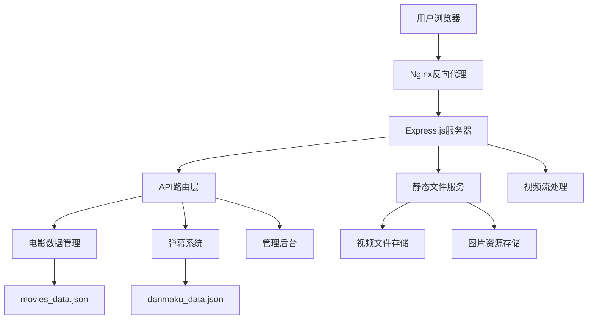

# SMTFILM 🎬

<div align="center">


[](https://nodejs.org/)
[](https://expressjs.com/)
[](https://developer.mozilla.org/en-US/docs/Web/HTML)
[](https://developer.mozilla.org/en-US/docs/Web/CSS)
[](https://developer.mozilla.org/en-US/docs/Web/JavaScript)

**一个现代化的全栈视频流媒体平台，专注于提供优质的影视内容观看体验**

[🚀 快速开始](#-快速开始) • [📖 技术文档](#-技术架构) • [🎯 功能特性](#-核心功能) • [🛠️ 开发指南](#-开发指南)

</div>

---

## 📋 项目概述

SMTFILM 是一个基于 Node.js + Express 的全栈视频流媒体平台，采用现代化的前端技术和后端架构，提供类似 Netflix 的用户体验。项目支持视频流播放、实时弹幕、响应式设计、管理后台等完整功能，是一个生产级别的视频平台解决方案。

### 🎯 设计理念

- **🎨 现代化UI**: 采用 Netflix 风格的暗色主题，毛玻璃效果，流畅动画
- **📱 移动优先**: 响应式设计，完美适配各种设备
- **⚡ 高性能**: 视频流优化，HTTP Range 支持，懒加载
- **🔧 易维护**: 模块化架构，清晰的代码结构
- **🚀 可扩展**: 支持动态内容管理，插件化设计

---

## ✨ 核心功能

### 🎥 视频播放系统

#### 高级视频播放器
- **🎬 自定义播放器**: 完全自定义的HTML5视频播放器
- **⏯️ 智能控制**: 播放/暂停、音量控制、全屏切换
- **📊 进度管理**: 可拖拽进度条，实时进度显示
- **🎯 精确定位**: 支持视频任意位置跳转
- **📱 触摸优化**: 移动端手势控制支持

#### 视频流技术
```javascript
// HTTP Range 请求支持，实现视频流播放
app.get('/videos/:videoName', async (req, res) => {
    const range = req.headers.range;
    if (range) {
        // 解析 Range 头，支持断点续传
        const parts = range.replace(/bytes=/, "").split("-");
        const start = parseInt(parts[0], 10);
        const end = parts[1] ? parseInt(parts[1], 10) : fileSize - 1;
        
        // 返回部分内容，支持拖拽和快进
        res.writeHead(206, {
            'Content-Range': `bytes ${start}-${end}/${fileSize}`,
            'Accept-Ranges': 'bytes',
            'Content-Length': end - start + 1,
            'Content-Type': 'video/mp4'
        });
    }
});
```

### 💬 实时弹幕系统

#### 弹幕核心功能
- **📝 实时发送**: 支持实时弹幕发送和接收
- **🎨 样式自定义**: 多种颜色、字体大小选择
- **⏰ 时间同步**: 弹幕与视频时间精确同步
- **💾 持久化存储**: 弹幕数据自动保存到JSON文件
- **🔄 自动加载**: 页面刷新后弹幕数据自动恢复

#### 弹幕技术实现
```javascript
// 弹幕数据结构
const danmakuStructure = {
    movieId: {
        episodeId: [
            {
                id: 'unique_id',
                time: 120.5,        // 视频时间点（秒）
                text: '弹幕内容',
                color: '#ffffff',   // 弹幕颜色
                fontSize: 16,       // 字体大小
                timestamp: Date.now(), // 发送时间戳
                ip: 'client_ip'     // 发送者IP（匿名化）
            }
        ]
    }
};

// 弹幕渲染算法
function renderDanmaku(danmakuList, currentTime) {
    const tolerance = 0.5; // 时间容差
    return danmakuList.filter(danmaku => 
        Math.abs(danmaku.time - currentTime) < tolerance
    ).map(danmaku => createDanmakuElement(danmaku));
}
```

### 🎪 轮播展示系统

#### 智能轮播
- **🖼️ 海报轮播**: 精美的首页推荐内容展示
- **⏰ 自动切换**: 智能定时切换，支持手动控制
- **📱 响应式**: 移动端16:9比例优化
- **🎨 视觉效果**: 平滑过渡动画，毛玻璃背景

#### 轮播技术实现
```css
/* 轮播容器样式 */
.carousel-container {
    position: relative;
    overflow: hidden;
    border-radius: 15px;
    box-shadow: 0 20px 60px rgba(0,0,0,0.8);
}

/* 移动端优化 */
@media (max-width: 768px) {
    .carousel-slide {
        aspect-ratio: 16/9; /* 移动端16:9比例 */
        height: auto;
    }
}
```

### 🔍 智能搜索系统

#### 搜索功能
- **⚡ 实时搜索**: 输入即搜索，无需等待
- **🎯 模糊匹配**: 支持标题、描述模糊搜索
- **📊 结果排序**: 智能相关性排序
- **💡 搜索建议**: 自动补全和搜索建议

```javascript
// 搜索算法实现
function searchMovies(query) {
    const searchTerm = query.toLowerCase().trim();
    return movies.filter(movie => {
        const titleMatch = movie.title.toLowerCase().includes(searchTerm);
        const descMatch = movie.description.toLowerCase().includes(searchTerm);
        return titleMatch || descMatch;
    }).sort((a, b) => {
        // 标题匹配优先级更高
        const aTitle = a.title.toLowerCase().includes(searchTerm);
        const bTitle = b.title.toLowerCase().includes(searchTerm);
        if (aTitle && !bTitle) return -1;
        if (!aTitle && bTitle) return 1;
        return 0;
    });
}
```

### 🎛️ 管理后台系统

#### 现代化管理界面
- **🎨 美观设计**: 现代化白色主题，渐变背景
- **📝 内容管理**: 视频增删改查，剧集管理
- **📊 实时预览**: 操作结果实时反馈
- **📱 响应式**: 完美适配各种设备

#### 动态数据管理
```javascript
// 数据持久化系统
class DataManager {
    constructor() {
        this.moviesFile = path.join(__dirname, 'movies_data.json');
        this.danmakuFile = path.join(__dirname, 'danmaku_data.json');
    }
    
    async saveMovies(movies) {
        const data = {
            movies: movies,
            lastUpdated: new Date().toISOString(),
            version: '1.0.0'
        };
        await fsPromises.writeFile(this.moviesFile, JSON.stringify(data, null, 2));
    }
    
    async loadMovies() {
        if (fs.existsSync(this.moviesFile)) {
            const data = await fsPromises.readFile(this.moviesFile, 'utf8');
            return JSON.parse(data).movies;
        }
        return [];
    }
}
```

---

## 🏗️ 技术架构

### 📊 系统架构图



### 🛠️ 技术栈详解

#### 后端技术栈

| 技术 | 版本 | 用途 | 特性 |
|------|------|------|------|
| **Node.js** | 18.0+ | 运行时环境 | 高性能、事件驱动、非阻塞I/O |
| **Express.js** | 4.18+ | Web框架 | 轻量级、中间件支持、RESTful API |
| **CORS** | 2.8+ | 跨域处理 | 安全的跨域资源共享 |
| **fs/promises** | 内置 | 文件操作 | 异步文件读写，数据持久化 |
| **path** | 内置 | 路径处理 | 跨平台路径操作 |

#### 前端技术栈

| 技术 | 用途 | 特性 |
|------|------|------|
| **HTML5** | 页面结构 | 语义化标签、视频支持、PWA特性 |
| **CSS3** | 样式设计 | Flexbox/Grid布局、动画、响应式 |
| **JavaScript ES6+** | 交互逻辑 | 原生JS、模块化、异步处理 |
| **Web APIs** | 浏览器功能 | Fetch API、DOM操作、事件处理 |

### 🗂️ 项目结构详解

```
SMTFILM/
├── 📁 backend/                    # 后端服务目录
│   ├── 📄 server.js               # Express服务器主文件
│   ├── 📄 package.json            # 后端依赖配置
│   ├── 📄 admin.html              # 管理后台页面
│   ├── 📄 movies_data.json        # 电影数据存储
│   ├── 📄 danmaku_data.json       # 弹幕数据存储
│   ├── 📁 images/                 # 海报图片存储
│   │   ├── 🖼️ na.jpg              # 电影海报
│   │   ├── 🖼️ na-hx.jpg           # 轮播海报
│   │   └── 🖼️ ...                 # 其他图片资源
│   └── 📁 videos/                 # 视频文件存储
│       ├── 🎬 na-1.mp4            # 视频文件
│       └── 🎬 ...                 # 其他视频文件
├── 📁 combined/                   # 前端文件目录
│   ├── 📄 smtfilm.html            # 主页面文件
│   ├── 📄 download.html           # 下载页面
│   └── 📁 展示/                   # 展示相关文件
├── 📁 smtfilm-server/             # 简化服务器
└── 📄 README.md                   # 项目文档
```

### 🔧 核心模块详解

#### 1. 视频流处理模块

```javascript
// 视频流处理核心逻辑
class VideoStreamHandler {
    constructor() {
        this.videoPath = path.join(__dirname, 'videos');
    }
    
    async handleVideoRequest(req, res) {
        const videoName = req.params.videoName;
        const videoPath = path.join(this.videoPath, videoName);
        
        // 安全检查
        if (!this.isValidVideoFile(videoPath)) {
            return res.status(404).send('Video not found');
        }
        
        const stat = await fs.promises.stat(videoPath);
        const fileSize = stat.size;
        const range = req.headers.range;
        
        if (range) {
            // 处理Range请求，支持视频拖拽
            return this.handleRangeRequest(req, res, videoPath, fileSize);
        } else {
            // 处理完整视频请求
            return this.handleFullVideoRequest(res, videoPath, fileSize);
        }
    }
    
    handleRangeRequest(req, res, videoPath, fileSize) {
        const parts = req.headers.range.replace(/bytes=/, "").split("-");
        const start = parseInt(parts[0], 10);
        const end = parts[1] ? parseInt(parts[1], 10) : fileSize - 1;
        const chunksize = (end - start) + 1;
        
        const file = fs.createReadStream(videoPath, { start, end });
        
        res.writeHead(206, {
            'Content-Range': `bytes ${start}-${end}/${fileSize}`,
            'Accept-Ranges': 'bytes',
            'Content-Length': chunksize,
            'Content-Type': 'video/mp4',
            'Cache-Control': 'public, max-age=31536000'
        });
        
        file.pipe(res);
    }
}
```

#### 2. 弹幕系统模块

```javascript
// 弹幕系统核心逻辑
class DanmakuSystem {
    constructor() {
        this.danmakuData = {};
        this.dataFile = path.join(__dirname, 'danmaku_data.json');
        this.loadData();
    }
    
    // 获取弹幕数据
    getDanmaku(movieId, episodeId) {
        const key = `${movieId}-${episodeId}`;
        return this.danmakuData[key] || [];
    }
    
    // 添加弹幕
    addDanmaku(movieId, episodeId, danmakuData) {
        const key = `${movieId}-${episodeId}`;
        
        if (!this.danmakuData[key]) {
            this.danmakuData[key] = [];
        }
        
        const danmaku = {
            id: this.generateId(),
            time: parseFloat(danmakuData.time),
            text: this.sanitizeText(danmakuData.text),
            color: danmakuData.color || '#ffffff',
            fontSize: danmakuData.fontSize || 16,
            timestamp: Date.now(),
            ip: this.hashIP(danmakuData.ip)
        };
        
        this.danmakuData[key].push(danmaku);
        this.saveData();
        
        return danmaku;
    }
    
    // 文本安全处理
    sanitizeText(text) {
        return text.replace(/<[^>]*>/g, '').substring(0, 100);
    }
    
    // IP地址哈希化（隐私保护）
    hashIP(ip) {
        return require('crypto').createHash('md5').update(ip).digest('hex').substring(0, 8);
    }
}
```

#### 3. 数据管理模块

```javascript
// 数据管理核心逻辑
class DataManager {
    constructor() {
        this.moviesFile = path.join(__dirname, 'movies_data.json');
        this.movies = [];
        this.loadMovies();
    }
    
    async loadMovies() {
        try {
            if (fs.existsSync(this.moviesFile)) {
                const data = await fs.promises.readFile(this.moviesFile, 'utf8');
                const moviesData = JSON.parse(data);
                this.movies = moviesData.movies || [];
                console.log(`已加载 ${this.movies.length} 部电影`);
            }
        } catch (error) {
            console.error('加载电影数据失败:', error);
        }
    }
    
    async saveMovies() {
        try {
            const data = {
                movies: this.movies,
                lastUpdated: new Date().toISOString(),
                version: '1.0.0'
            };
            await fs.promises.writeFile(this.moviesFile, JSON.stringify(data, null, 2));
            console.log('电影数据保存成功');
        } catch (error) {
            console.error('保存电影数据失败:', error);
        }
    }
    
    // CRUD操作
    addMovie(movieData) {
        const newMovie = {
            id: this.generateId(),
            ...movieData,
            createdAt: new Date().toISOString()
        };
        this.movies.push(newMovie);
        this.saveMovies();
        return newMovie;
    }
    
    updateMovie(id, movieData) {
        const index = this.movies.findIndex(m => m.id === parseInt(id));
        if (index !== -1) {
            this.movies[index] = {
                ...this.movies[index],
                ...movieData,
                updatedAt: new Date().toISOString()
            };
            this.saveMovies();
            return this.movies[index];
        }
        return null;
    }
    
    deleteMovie(id) {
        const index = this.movies.findIndex(m => m.id === parseInt(id));
        if (index !== -1) {
            const deleted = this.movies.splice(index, 1)[0];
            this.saveMovies();
            return deleted;
        }
        return null;
    }
}
```

---

## 🚀 快速开始

### 📋 环境要求

- **Node.js**: 18.0 或更高版本
- **npm**: 8.0 或更高版本
- **操作系统**: Windows 10+, macOS 10.15+, Ubuntu 18.04+
- **浏览器**: Chrome 90+, Firefox 88+, Safari 14+, Edge 90+

### ⚡ 一键安装

```bash
# 1. 克隆项目
git clone https://github.com/your-username/smtfilm.git
cd smtfilm

# 2. 安装依赖
cd backend
npm install

# 3. 启动服务
npm run dev

# 4. 访问应用
# 浏览器打开: http://localhost:3000
```

### 🔧 详细安装步骤

#### 1. 项目克隆与依赖安装

```bash
# 克隆项目到本地
git clone https://github.com/your-username/smtfilm.git
cd smtfilm

# 进入后端目录
cd backend

# 安装后端依赖
npm install

# 检查依赖是否安装成功
npm list
```

#### 2. 环境配置

```bash
# 创建环境配置文件（可选）
cp .env.example .env

# 编辑配置文件
# PORT=3000
# NODE_ENV=development
# VIDEO_PATH=./videos
# IMAGE_PATH=./images
```

#### 3. 启动服务

```bash
# 开发模式启动（推荐）
npm run dev

# 或者生产模式启动
npm start

# 查看服务状态
curl http://localhost:3000/api/movies
```

#### 4. 验证安装

- **主页面**: http://localhost:3000
- **管理后台**: http://localhost:3000/admin
- **API接口**: http://localhost:3000/api/movies

---

## 📖 API 文档

### 🎬 电影相关接口

#### 获取电影列表
```http
GET /api/movies
```

**响应示例**:
```json
[
    {
        "id": 1,
        "title": "逆爱",
        "poster": "/images/na.jpg",
        "description": "电影描述...",
        "episodes": [
            {
                "id": 1,
                "title": "第一集",
                "video": "/videos/na-1.mp4"
            }
        ]
    }
]
```

#### 获取电影详情
```http
GET /api/movies/:id
```

**参数**:
- `id` (number): 电影ID

#### 获取推荐内容
```http
GET /api/featured
```

### 🎥 视频流接口

#### 视频流播放
```http
GET /videos/:videoName
```

**特性**:
- 支持HTTP Range请求
- 断点续传
- 视频拖拽定位
- 缓存优化

**请求头**:
```http
Range: bytes=0-1023
Accept: video/mp4
```

**响应头**:
```http
Content-Range: bytes 0-1023/2048
Accept-Ranges: bytes
Content-Type: video/mp4
Cache-Control: public, max-age=31536000
```

### 💬 弹幕系统接口

#### 获取弹幕
```http
GET /api/danmaku/:movieId/:episodeId
```

**响应示例**:
```json
[
    {
        "id": "danmaku_001",
        "time": 120.5,
        "text": "弹幕内容",
        "color": "#ffffff",
        "fontSize": 16,
        "timestamp": 1640995200000
    }
]
```

#### 发送弹幕
```http
POST /api/danmaku/:movieId/:episodeId
```

**请求体**:
```json
{
    "time": 120.5,
    "text": "弹幕内容",
    "color": "#ffffff",
    "fontSize": 16
}
```

### 🛠️ 管理后台接口

#### 添加电影
```http
POST /api/admin/movies
```

#### 更新电影
```http
PUT /api/admin/movies/:id
```

#### 删除电影
```http
DELETE /api/admin/movies/:id
```

---

## 📱 响应式设计详解

### 🎨 设计原则

#### 移动优先策略
```css
/* 基础样式（移动端） */
.movie-grid {
    display: grid;
    grid-template-columns: repeat(2, 1fr);
    gap: 15px;
    padding: 20px;
}

/* 平板端适配 */
@media (min-width: 768px) {
    .movie-grid {
        grid-template-columns: repeat(3, 1fr);
        gap: 20px;
        padding: 30px;
    }
}

/* 桌面端适配 */
@media (min-width: 1200px) {
    .movie-grid {
        grid-template-columns: repeat(5, 1fr);
        gap: 25px;
        padding: 50px;
    }
}
```

#### 断点系统

| 设备类型 | 屏幕宽度 | 网格列数 | 特殊优化 |
|----------|----------|----------|----------|
| 手机 | < 768px | 2列 | 16:9轮播，大按钮 |
| 平板 | 768px - 1199px | 3列 | 触摸优化 |
| 桌面 | ≥ 1200px | 5列 | 鼠标悬停效果 |

### 📱 移动端优化

#### iOS Safari 适配
```css
/* iOS Safari 全屏优化 */
body {
    /* 安全区域适配 */
    padding-top: env(safe-area-inset-top);
    padding-bottom: env(safe-area-inset-bottom);
    
    /* 防止缩放 */
    -webkit-text-size-adjust: 100%;
    -webkit-touch-callout: none;
    -webkit-user-select: none;
    
    /* 触摸优化 */
    touch-action: manipulation;
}

/* 视口高度修复 */
:root {
    --vh: 1vh;
}

html {
    height: calc(var(--vh, 1vh) * 100);
}
```

#### 触摸交互优化
```javascript
// 触摸事件处理
class TouchHandler {
    constructor(element) {
        this.element = element;
        this.startX = 0;
        this.startY = 0;
        this.threshold = 50;
        
        this.bindEvents();
    }
    
    bindEvents() {
        this.element.addEventListener('touchstart', this.handleTouchStart.bind(this));
        this.element.addEventListener('touchmove', this.handleTouchMove.bind(this));
        this.element.addEventListener('touchend', this.handleTouchEnd.bind(this));
    }
    
    handleTouchStart(e) {
        this.startX = e.touches[0].clientX;
        this.startY = e.touches[0].clientY;
    }
    
    handleTouchMove(e) {
        // 防止页面滚动
        if (this.isVideoArea(e.target)) {
            e.preventDefault();
        }
    }
    
    handleTouchEnd(e) {
        const deltaX = e.changedTouches[0].clientX - this.startX;
        const deltaY = e.changedTouches[0].clientY - this.startY;
        
        // 手势识别
        if (Math.abs(deltaX) > this.threshold) {
            if (deltaX > 0) {
                this.onSwipeRight();
            } else {
                this.onSwipeLeft();
            }
        }
    }
}
```

---

## 🎨 UI/UX 设计详解

### 🌈 视觉设计系统

#### 色彩方案
```css
:root {
    /* 主色调 */
    --primary-red: #e50914;
    --primary-dark: #141414;
    
    /* 背景色 */
    --bg-primary: #141414;
    --bg-secondary: #1a1a1a;
    --bg-tertiary: #222222;
    
    /* 文字色 */
    --text-primary: #ffffff;
    --text-secondary: #b3b3b3;
    --text-muted: #808080;
    
    /* 状态色 */
    --success: #46d369;
    --warning: #fb8c00;
    --error: #f44336;
    
    /* 透明度 */
    --overlay-light: rgba(0, 0, 0, 0.3);
    --overlay-medium: rgba(0, 0, 0, 0.6);
    --overlay-heavy: rgba(0, 0, 0, 0.8);
}
```

#### 字体系统
```css
/* 字体层级 */
.text-hero {
    font-size: clamp(2rem, 5vw, 4rem);
    font-weight: 700;
    line-height: 1.1;
}

.text-title {
    font-size: clamp(1.5rem, 3vw, 2.5rem);
    font-weight: 600;
    line-height: 1.2;
}

.text-subtitle {
    font-size: clamp(1rem, 2vw, 1.25rem);
    font-weight: 500;
    line-height: 1.4;
}

.text-body {
    font-size: clamp(0.875rem, 1.5vw, 1rem);
    font-weight: 400;
    line-height: 1.6;
}
```

### ✨ 动画系统

#### 过渡动画
```css
/* 全局过渡 */
* {
    transition: all 0.3s cubic-bezier(0.4, 0, 0.2, 1);
}

/* 悬停效果 */
.movie-card {
    transform: scale(1);
    transition: transform 0.3s ease, box-shadow 0.3s ease;
}

.movie-card:hover {
    transform: scale(1.05);
    box-shadow: 0 20px 40px rgba(0, 0, 0, 0.8);
}

/* 加载动画 */
@keyframes pulse {
    0%, 100% { opacity: 1; }
    50% { opacity: 0.5; }
}

.loading {
    animation: pulse 2s infinite;
}
```

#### 页面转场
```javascript
// 页面转场动画
class PageTransition {
    static fadeIn(element, duration = 300) {
        element.style.opacity = '0';
        element.style.transform = 'translateY(20px)';
        
        requestAnimationFrame(() => {
            element.style.transition = `opacity ${duration}ms ease, transform ${duration}ms ease`;
            element.style.opacity = '1';
            element.style.transform = 'translateY(0)';
        });
    }
    
    static slideIn(element, direction = 'left', duration = 300) {
        const translateX = direction === 'left' ? '-100%' : '100%';
        
        element.style.transform = `translateX(${translateX})`;
        
        requestAnimationFrame(() => {
            element.style.transition = `transform ${duration}ms ease`;
            element.style.transform = 'translateX(0)';
        });
    }
}
```

---

## ⚡ 性能优化详解

### 🚀 前端性能优化

#### 图片懒加载
```javascript
// 图片懒加载实现
class LazyImageLoader {
    constructor() {
        this.imageObserver = new IntersectionObserver(
            this.handleIntersection.bind(this),
            { threshold: 0.1 }
        );
        
        this.init();
    }
    
    init() {
        const lazyImages = document.querySelectorAll('img[data-src]');
        lazyImages.forEach(img => this.imageObserver.observe(img));
    }
    
    handleIntersection(entries) {
        entries.forEach(entry => {
            if (entry.isIntersecting) {
                const img = entry.target;
                img.src = img.dataset.src;
                img.classList.add('loaded');
                this.imageObserver.unobserve(img);
            }
        });
    }
}
```

#### 视频预加载策略
```javascript
// 智能视频预加载
class VideoPreloader {
    constructor() {
        this.preloadQueue = [];
        this.maxConcurrent = 2;
        this.currentLoading = 0;
    }
    
    preloadVideo(videoUrl, priority = 'normal') {
        const preloadItem = {
            url: videoUrl,
            priority: priority,
            timestamp: Date.now()
        };
        
        if (priority === 'high') {
            this.preloadQueue.unshift(preloadItem);
        } else {
            this.preloadQueue.push(preloadItem);
        }
        
        this.processQueue();
    }
    
    processQueue() {
        if (this.currentLoading >= this.maxConcurrent || this.preloadQueue.length === 0) {
            return;
        }
        
        const item = this.preloadQueue.shift();
        this.currentLoading++;
        
        const video = document.createElement('video');
        video.preload = 'metadata';
        video.src = item.url;
        
        video.addEventListener('loadedmetadata', () => {
            this.currentLoading--;
            this.processQueue();
        });
        
        video.addEventListener('error', () => {
            this.currentLoading--;
            this.processQueue();
        });
    }
}
```

### 🔧 后端性能优化

#### 缓存策略
```javascript
// 内存缓存实现
class MemoryCache {
    constructor(maxSize = 100, ttl = 3600000) { // 1小时TTL
        this.cache = new Map();
        this.maxSize = maxSize;
        this.ttl = ttl;
    }
    
    set(key, value) {
        // 清理过期缓存
        this.cleanup();
        
        // 如果缓存已满，删除最旧的项
        if (this.cache.size >= this.maxSize) {
            const firstKey = this.cache.keys().next().value;
            this.cache.delete(firstKey);
        }
        
        this.cache.set(key, {
            value: value,
            timestamp: Date.now()
        });
    }
    
    get(key) {
        const item = this.cache.get(key);
        
        if (!item) return null;
        
        // 检查是否过期
        if (Date.now() - item.timestamp > this.ttl) {
            this.cache.delete(key);
            return null;
        }
        
        return item.value;
    }
    
    cleanup() {
        const now = Date.now();
        for (const [key, item] of this.cache.entries()) {
            if (now - item.timestamp > this.ttl) {
                this.cache.delete(key);
            }
        }
    }
}
```

#### 数据库优化
```javascript
// 数据查询优化
class OptimizedDataManager {
    constructor() {
        this.cache = new MemoryCache();
        this.indexedMovies = new Map();
        this.buildIndexes();
    }
    
    buildIndexes() {
        // 构建索引以加速查询
        this.movies.forEach(movie => {
            this.indexedMovies.set(movie.id, movie);
        });
    }
    
    getMovieById(id) {
        const cacheKey = `movie_${id}`;
        let movie = this.cache.get(cacheKey);
        
        if (!movie) {
            movie = this.indexedMovies.get(parseInt(id));
            if (movie) {
                this.cache.set(cacheKey, movie);
            }
        }
        
        return movie;
    }
    
    searchMovies(query) {
        const cacheKey = `search_${query.toLowerCase()}`;
        let results = this.cache.get(cacheKey);
        
        if (!results) {
            results = this.performSearch(query);
            this.cache.set(cacheKey, results);
        }
        
        return results;
    }
}
```

---

## 🔒 安全性详解

### 🛡️ 安全措施

#### 输入验证与清理
```javascript
// 输入验证中间件
class InputValidator {
    static validateDanmaku(req, res, next) {
        const { time, text, color, fontSize } = req.body;
        
        // 时间验证
        if (typeof time !== 'number' || time < 0 || time > 86400) {
            return res.status(400).json({ error: '无效的时间参数' });
        }
        
        // 文本验证
        if (typeof text !== 'string' || text.length === 0 || text.length > 100) {
            return res.status(400).json({ error: '弹幕内容长度必须在1-100字符之间' });
        }
        
        // HTML标签清理
        req.body.text = text.replace(/<[^>]*>/g, '');
        
        // 颜色验证
        if (color && !/^#[0-9A-Fa-f]{6}$/.test(color)) {
            return res.status(400).json({ error: '无效的颜色格式' });
        }
        
        // 字体大小验证
        if (fontSize && (fontSize < 12 || fontSize > 24)) {
            return res.status(400).json({ error: '字体大小必须在12-24之间' });
        }
        
        next();
    }
    
    static validateMovieData(req, res, next) {
        const { title, description, episodes } = req.body;
        
        // 标题验证
        if (!title || typeof title !== 'string' || title.length > 100) {
            return res.status(400).json({ error: '标题不能为空且长度不能超过100字符' });
        }
        
        // 描述验证
        if (description && description.length > 1000) {
            return res.status(400).json({ error: '描述长度不能超过1000字符' });
        }
        
        // 剧集验证
        if (episodes && !Array.isArray(episodes)) {
            return res.status(400).json({ error: '剧集数据格式错误' });
        }
        
        next();
    }
}
```

#### 文件安全
```javascript
// 文件安全检查
class FileSecurity {
    static isValidVideoFile(filePath) {
        // 路径遍历攻击防护
        const normalizedPath = path.normalize(filePath);
        const videoDir = path.join(__dirname, 'videos');
        
        if (!normalizedPath.startsWith(videoDir)) {
            return false;
        }
        
        // 文件扩展名检查
        const allowedExtensions = ['.mp4', '.webm', '.ogg'];
        const ext = path.extname(normalizedPath).toLowerCase();
        
        return allowedExtensions.includes(ext);
    }
    
    static isValidImageFile(filePath) {
        const normalizedPath = path.normalize(filePath);
        const imageDir = path.join(__dirname, 'images');
        
        if (!normalizedPath.startsWith(imageDir)) {
            return false;
        }
        
        const allowedExtensions = ['.jpg', '.jpeg', '.png', '.webp'];
        const ext = path.extname(normalizedPath).toLowerCase();
        
        return allowedExtensions.includes(ext);
    }
}
```

#### 速率限制
```javascript
// 速率限制中间件
class RateLimiter {
    constructor(windowMs = 60000, maxRequests = 100) {
        this.windowMs = windowMs;
        this.maxRequests = maxRequests;
        this.requests = new Map();
        
        // 定期清理过期记录
        setInterval(() => this.cleanup(), this.windowMs);
    }
    
    middleware() {
        return (req, res, next) => {
            const clientIP = this.getClientIP(req);
            const now = Date.now();
            const windowStart = now - this.windowMs;
            
            // 获取客户端请求记录
            let clientRequests = this.requests.get(clientIP) || [];
            
            // 过滤掉过期的请求
            clientRequests = clientRequests.filter(timestamp => timestamp > windowStart);
            
            // 检查是否超过限制
            if (clientRequests.length >= this.maxRequests) {
                return res.status(429).json({
                    error: '请求过于频繁，请稍后再试',
                    retryAfter: Math.ceil(this.windowMs / 1000)
                });
            }
            
            // 记录当前请求
            clientRequests.push(now);
            this.requests.set(clientIP, clientRequests);
            
            next();
        };
    }
    
    getClientIP(req) {
        return req.headers['x-forwarded-for'] || 
               req.headers['x-real-ip'] || 
               req.connection.remoteAddress || 
               req.ip;
    }
    
    cleanup() {
        const now = Date.now();
        const windowStart = now - this.windowMs;
        
        for (const [ip, requests] of this.requests.entries()) {
            const validRequests = requests.filter(timestamp => timestamp > windowStart);
            if (validRequests.length === 0) {
                this.requests.delete(ip);
            } else {
                this.requests.set(ip, validRequests);
            }
        }
    }
}
```

---

## 🛠️ 开发指南

### 🔧 开发环境配置

#### 推荐开发工具

| 工具 | 用途 | 推荐版本 |
|------|------|----------|
| **VS Code** | 代码编辑器 | 最新版 |
| **Node.js** | 运行环境 | 18.0+ |
| **npm** | 包管理器 | 8.0+ |
| **Git** | 版本控制 | 2.30+ |
| **Postman** | API测试 | 最新版 |

#### VS Code 扩展推荐

```json
{
    "recommendations": [
        "ms-vscode.vscode-json",
        "bradlc.vscode-tailwindcss",
        "esbenp.prettier-vscode",
        "ms-vscode.vscode-eslint",
        "formulahendry.auto-rename-tag",
        "christian-kohler.path-intellisense",
        "ms-vscode.vscode-typescript-next"
    ]
}
```

#### 开发脚本

```json
{
    "scripts": {
        "dev": "nodemon server.js",
        "start": "node server.js",
        "test": "jest",
        "lint": "eslint .",
        "format": "prettier --write .",
        "build": "npm run lint && npm run test",
        "deploy": "npm run build && pm2 restart smtfilm"
    }
}
```

### 📝 代码规范

#### JavaScript 代码规范

```javascript
// 使用 ES6+ 语法
const express = require('express');
const { promisify } = require('util');

// 使用 async/await 而不是回调
async function loadMovieData() {
    try {
        const data = await fs.promises.readFile(filePath, 'utf8');
        return JSON.parse(data);
    } catch (error) {
        console.error('加载数据失败:', error);
        return null;
    }
}

// 使用解构赋值
const { title, description, episodes } = movieData;

// 使用模板字符串
const message = `电影 "${title}" 添加成功`;

// 使用箭头函数
const filterMovies = (movies, query) => {
    return movies.filter(movie => 
        movie.title.toLowerCase().includes(query.toLowerCase())
    );
};
```

#### CSS 代码规范

```css
/* 使用 BEM 命名规范 */
.movie-card {
    /* 块级元素 */
}

.movie-card__title {
    /* 元素 */
}

.movie-card--featured {
    /* 修饰符 */
}

/* 使用 CSS 自定义属性 */
:root {
    --primary-color: #e50914;
    --secondary-color: #141414;
    --border-radius: 8px;
}

.button {
    background-color: var(--primary-color);
    border-radius: var(--border-radius);
}

/* 移动优先的媒体查询 */
.container {
    padding: 1rem;
}

@media (min-width: 768px) {
    .container {
        padding: 2rem;
    }
}
```

### 🧪 测试策略

#### 单元测试

```javascript
// tests/danmaku.test.js
const DanmakuSystem = require('../src/DanmakuSystem');

describe('弹幕系统测试', () => {
    let danmakuSystem;
    
    beforeEach(() => {
        danmakuSystem = new DanmakuSystem();
    });
    
    test('应该能够添加弹幕', () => {
        const danmaku = {
            time: 120.5,
            text: '测试弹幕',
            color: '#ffffff',
            fontSize: 16
        };
        
        const result = danmakuSystem.addDanmaku(1, 1, danmaku);
        
        expect(result).toHaveProperty('id');
        expect(result.text).toBe('测试弹幕');
        expect(result.time).toBe(120.5);
    });
    
    test('应该能够获取弹幕列表', () => {
        // 添加测试弹幕
        danmakuSystem.addDanmaku(1, 1, {
            time: 60,
            text: '弹幕1',
            color: '#ffffff'
        });
        
        const danmakuList = danmakuSystem.getDanmaku(1, 1);
        
        expect(danmakuList).toHaveLength(1);
        expect(danmakuList[0].text).toBe('弹幕1');
    });
    
    test('应该过滤恶意HTML标签', () => {
        const maliciousDanmaku = {
            time: 30,
            text: '<script>alert("xss")</script>正常文本',
            color: '#ffffff'
        };
        
        const result = danmakuSystem.addDanmaku(1, 1, maliciousDanmaku);
        
        expect(result.text).toBe('正常文本');
        expect(result.text).not.toContain('<script>');
    });
});
```

#### API 测试

```javascript
// tests/api.test.js
const request = require('supertest');
const app = require('../server');

describe('API 接口测试', () => {
    test('GET /api/movies 应该返回电影列表', async () => {
        const response = await request(app)
            .get('/api/movies')
            .expect(200);
        
        expect(Array.isArray(response.body)).toBe(true);
        expect(response.body.length).toBeGreaterThan(0);
    });
    
    test('GET /api/movies/:id 应该返回指定电影', async () => {
        const response = await request(app)
            .get('/api/movies/1')
            .expect(200);
        
        expect(response.body).toHaveProperty('id', 1);
        expect(response.body).toHaveProperty('title');
        expect(response.body).toHaveProperty('episodes');
    });
    
    test('POST /api/danmaku/:movieId/:episodeId 应该添加弹幕', async () => {
        const danmaku = {
            time: 120,
            text: '测试弹幕',
            color: '#ffffff',
            fontSize: 16
        };
        
        const response = await request(app)
            .post('/api/danmaku/1/1')
            .send(danmaku)
            .expect(200);
        
        expect(response.body).toHaveProperty('id');
        expect(response.body.text).toBe('测试弹幕');
    });
});
```

### 🚀 部署指南

#### 生产环境部署

```bash
# 1. 服务器环境准备
sudo apt update
sudo apt install nodejs npm nginx pm2 -y

# 2. 克隆项目
git clone https://github.com/your-username/smtfilm.git
cd smtfilm/backend

# 3. 安装依赖
npm ci --production

# 4. 配置环境变量
cp .env.example .env
nano .env

# 5. 使用 PM2 启动应用
pm2 start ecosystem.config.js

# 6. 配置 Nginx 反向代理
sudo nano /etc/nginx/sites-available/smtfilm
```

#### Nginx 配置

```nginx
server {
    listen 80;
    server_name your-domain.com;
    
    # 重定向到 HTTPS
    return 301 https://$server_name$request_uri;
}

server {
    listen 443 ssl http2;
    server_name your-domain.com;
    
    # SSL 证书配置
    ssl_certificate /path/to/certificate.crt;
    ssl_certificate_key /path/to/private.key;
    
    # 安全头
    add_header X-Frame-Options DENY;
    add_header X-Content-Type-Options nosniff;
    add_header X-XSS-Protection "1; mode=block";
    
    # 静态文件缓存
    location ~* \.(jpg|jpeg|png|gif|ico|css|js)$ {
        expires 1y;
        add_header Cache-Control "public, immutable";
    }
    
    # 视频文件特殊处理
    location /videos/ {
        proxy_pass http://localhost:3000;
        proxy_set_header Host $host;
        proxy_set_header X-Real-IP $remote_addr;
        proxy_set_header X-Forwarded-For $proxy_add_x_forwarded_for;
        
        # 支持大文件传输
        proxy_max_temp_file_size 0;
        proxy_buffering off;
    }
    
    # API 代理
    location /api/ {
        proxy_pass http://localhost:3000;
        proxy_set_header Host $host;
        proxy_set_header X-Real-IP $remote_addr;
        proxy_set_header X-Forwarded-For $proxy_add_x_forwarded_for;
        proxy_set_header X-Forwarded-Proto $scheme;
    }
    
    # 主应用代理
    location / {
        proxy_pass http://localhost:3000;
        proxy_set_header Host $host;
        proxy_set_header X-Real-IP $remote_addr;
        proxy_set_header X-Forwarded-For $proxy_add_x_forwarded_for;
        proxy_set_header X-Forwarded-Proto $scheme;
    }
}
```

#### PM2 配置

```javascript
// ecosystem.config.js
module.exports = {
    apps: [{
        name: 'smtfilm',
        script: 'server.js',
        instances: 'max',
        exec_mode: 'cluster',
        env: {
            NODE_ENV: 'production',
            PORT: 3000
        },
        error_file: './logs/err.log',
        out_file: './logs/out.log',
        log_file: './logs/combined.log',
        time: true,
        max_memory_restart: '1G',
        node_args: '--max-old-space-size=1024'
    }]
};
```

---

## 📊 监控与维护

### 📈 性能监控

#### 系统监控

```javascript
// 性能监控中间件
class PerformanceMonitor {
    constructor() {
        this.metrics = {
            requests: 0,
            errors: 0,
            responseTime: [],
            memoryUsage: [],
            cpuUsage: []
        };
        
        // 定期收集系统指标
        setInterval(() => this.collectSystemMetrics(), 60000);
    }
    
    middleware() {
        return (req, res, next) => {
            const startTime = Date.now();
            
            res.on('finish', () => {
                const responseTime = Date.now() - startTime;
                this.recordRequest(req, res, responseTime) {
        this.metrics.requests++;
        this.metrics.responseTime.push(responseTime);
        
        if (res.statusCode >= 400) {
            this.metrics.errors++;
        }
        
        // 保持最近1000条记录
        if (this.metrics.responseTime.length > 1000) {
            this.metrics.responseTime.shift();
        }
    }
    
    collectSystemMetrics() {
        const memUsage = process.memoryUsage();
        this.metrics.memoryUsage.push({
            timestamp: Date.now(),
            heapUsed: memUsage.heapUsed,
            heapTotal: memUsage.heapTotal,
            external: memUsage.external
        });
        
        // 保持最近100条记录
        if (this.metrics.memoryUsage.length > 100) {
            this.metrics.memoryUsage.shift();
        }
    }
    
    getMetrics() {
        const avgResponseTime = this.metrics.responseTime.length > 0 
            ? this.metrics.responseTime.reduce((a, b) => a + b, 0) / this.metrics.responseTime.length 
            : 0;
            
        return {
            totalRequests: this.metrics.requests,
            totalErrors: this.metrics.errors,
            errorRate: this.metrics.requests > 0 ? (this.metrics.errors / this.metrics.requests) * 100 : 0,
            avgResponseTime: Math.round(avgResponseTime),
            currentMemoryUsage: process.memoryUsage(),
            uptime: process.uptime()
        };
    }
}
```

#### 日志系统

```javascript
// 日志管理系统
class Logger {
    constructor() {
        this.logLevels = {
            ERROR: 0,
            WARN: 1,
            INFO: 2,
            DEBUG: 3
        };
        
        this.currentLevel = this.logLevels.INFO;
        this.logFile = path.join(__dirname, 'logs', 'app.log');
        this.errorFile = path.join(__dirname, 'logs', 'error.log');
        
        this.ensureLogDirectory();
    }
    
    ensureLogDirectory() {
        const logDir = path.dirname(this.logFile);
        if (!fs.existsSync(logDir)) {
            fs.mkdirSync(logDir, { recursive: true });
        }
    }
    
    log(level, message, meta = {}) {
        if (this.logLevels[level] > this.currentLevel) {
            return;
        }
        
        const timestamp = new Date().toISOString();
        const logEntry = {
            timestamp,
            level,
            message,
            ...meta
        };
        
        // 控制台输出
        console.log(`[${timestamp}] ${level}: ${message}`);
        
        // 文件输出
        const logLine = JSON.stringify(logEntry) + '\n';
        fs.appendFileSync(this.logFile, logLine);
        
        // 错误日志单独记录
        if (level === 'ERROR') {
            fs.appendFileSync(this.errorFile, logLine);
        }
    }
    
    error(message, meta) { this.log('ERROR', message, meta); }
    warn(message, meta) { this.log('WARN', message, meta); }
    info(message, meta) { this.log('INFO', message, meta); }
    debug(message, meta) { this.log('DEBUG', message, meta); }
}
```

### 🔧 维护工具

#### 数据备份

```javascript
// 数据备份系统
class BackupManager {
    constructor() {
        this.backupDir = path.join(__dirname, 'backups');
        this.ensureBackupDirectory();
        
        // 每天凌晨2点自动备份
        this.scheduleBackup();
    }
    
    ensureBackupDirectory() {
        if (!fs.existsSync(this.backupDir)) {
            fs.mkdirSync(this.backupDir, { recursive: true });
        }
    }
    
    async createBackup() {
        const timestamp = new Date().toISOString().replace(/[:.]/g, '-');
        const backupName = `backup_${timestamp}`;
        const backupPath = path.join(this.backupDir, backupName);
        
        try {
            // 创建备份目录
            fs.mkdirSync(backupPath, { recursive: true });
            
            // 备份数据文件
            const dataFiles = ['movies_data.json', 'danmaku_data.json'];
            for (const file of dataFiles) {
                const sourcePath = path.join(__dirname, file);
                const targetPath = path.join(backupPath, file);
                
                if (fs.existsSync(sourcePath)) {
                    await fs.promises.copyFile(sourcePath, targetPath);
                }
            }
            
            // 创建备份信息文件
            const backupInfo = {
                timestamp: new Date().toISOString(),
                version: '1.0.0',
                files: dataFiles,
                size: await this.calculateBackupSize(backupPath)
            };
            
            await fs.promises.writeFile(
                path.join(backupPath, 'backup_info.json'),
                JSON.stringify(backupInfo, null, 2)
            );
            
            console.log(`备份创建成功: ${backupName}`);
            return backupPath;
            
        } catch (error) {
            console.error('备份创建失败:', error);
            throw error;
        }
    }
    
    async restoreBackup(backupName) {
        const backupPath = path.join(this.backupDir, backupName);
        
        if (!fs.existsSync(backupPath)) {
            throw new Error(`备份不存在: ${backupName}`);
        }
        
        try {
            const dataFiles = ['movies_data.json', 'danmaku_data.json'];
            
            for (const file of dataFiles) {
                const sourcePath = path.join(backupPath, file);
                const targetPath = path.join(__dirname, file);
                
                if (fs.existsSync(sourcePath)) {
                    await fs.promises.copyFile(sourcePath, targetPath);
                }
            }
            
            console.log(`备份恢复成功: ${backupName}`);
            
        } catch (error) {
            console.error('备份恢复失败:', error);
            throw error;
        }
    }
    
    scheduleBackup() {
        // 每24小时执行一次备份
        setInterval(() => {
            const now = new Date();
            if (now.getHours() === 2 && now.getMinutes() === 0) {
                this.createBackup();
            }
        }, 60000); // 每分钟检查一次
    }
    
    async calculateBackupSize(backupPath) {
        let totalSize = 0;
        const files = await fs.promises.readdir(backupPath);
        
        for (const file of files) {
            const filePath = path.join(backupPath, file);
            const stats = await fs.promises.stat(filePath);
            totalSize += stats.size;
        }
        
        return totalSize;
    }
}
```

---

## 🚀 未来规划

### 📋 开发路线图

#### 短期目标 (1-3个月)

- [ ] **用户系统**: 用户注册、登录、个人中心
- [ ] **观看历史**: 记录用户观看进度和历史
- [ ] **收藏功能**: 用户可收藏喜欢的影片
- [ ] **评分系统**: 用户可对影片进行评分
- [ ] **弹幕增强**: 弹幕过滤、举报功能

#### 中期目标 (3-6个月)

- [ ] **推荐算法**: 基于用户行为的智能推荐
- [ ] **多语言支持**: 国际化和本地化
- [ ] **移动端APP**: React Native 移动应用
- [ ] **实时通知**: WebSocket 实时消息推送
- [ ] **CDN集成**: 视频内容分发网络

#### 长期目标 (6-12个月)

- [ ] **微服务架构**: 服务拆分和容器化部署
- [ ] **大数据分析**: 用户行为分析和数据可视化
- [ ] **AI功能**: 智能字幕、内容审核
- [ ] **直播功能**: 实时视频流直播
- [ ] **社交功能**: 用户互动和社区建设

### 🔧 技术升级计划

#### 数据库迁移

```javascript
// 从JSON文件迁移到MongoDB
class DatabaseMigration {
    constructor() {
        this.mongoUrl = process.env.MONGODB_URL || 'mongodb://localhost:27017/smtfilm';
    }
    
    async migrateToMongoDB() {
        const { MongoClient } = require('mongodb');
        const client = new MongoClient(this.mongoUrl);
        
        try {
            await client.connect();
            const db = client.db('smtfilm');
            
            // 迁移电影数据
            const moviesData = await this.loadJSONData('movies_data.json');
            if (moviesData.movies) {
                await db.collection('movies').insertMany(moviesData.movies);
            }
            
            // 迁移弹幕数据
            const danmakuData = await this.loadJSONData('danmaku_data.json');
            const danmakuArray = this.convertDanmakuToArray(danmakuData);
            if (danmakuArray.length > 0) {
                await db.collection('danmaku').insertMany(danmakuArray);
            }
            
            console.log('数据库迁移完成');
            
        } catch (error) {
            console.error('数据库迁移失败:', error);
        } finally {
            await client.close();
        }
    }
    
    convertDanmakuToArray(danmakuData) {
        const result = [];
        
        for (const [key, danmakuList] of Object.entries(danmakuData)) {
            const [movieId, episodeId] = key.split('-');
            
            for (const danmaku of danmakuList) {
                result.push({
                    ...danmaku,
                    movieId: parseInt(movieId),
                    episodeId: parseInt(episodeId)
                });
            }
        }
        
        return result;
    }
}
```

#### 缓存系统升级

```javascript
// Redis缓存集成
class RedisCache {
    constructor() {
        this.redis = require('redis').createClient({
            host: process.env.REDIS_HOST || 'localhost',
            port: process.env.REDIS_PORT || 6379
        });
        
        this.redis.on('error', (err) => {
            console.error('Redis连接错误:', err);
        });
    }
    
    async set(key, value, ttl = 3600) {
        try {
            const serialized = JSON.stringify(value);
            await this.redis.setex(key, ttl, serialized);
        } catch (error) {
            console.error('Redis设置失败:', error);
        }
    }
    
    async get(key) {
        try {
            const value = await this.redis.get(key);
            return value ? JSON.parse(value) : null;
        } catch (error) {
            console.error('Redis获取失败:', error);
            return null;
        }
    }
    
    async del(key) {
        try {
            await this.redis.del(key);
        } catch (error) {
            console.error('Redis删除失败:', error);
        }
    }
}
```

---

## 🤝 贡献指南

### 📋 贡献流程

1. **Fork 项目**
   ```bash
   git clone https://github.com/your-username/smtfilm.git
   cd smtfilm
   ```

2. **创建功能分支**
   ```bash
   git checkout -b feature/your-feature-name
   ```

3. **开发和测试**
   ```bash
   npm run dev
   npm test
   ```

4. **提交更改**
   ```bash
   git add .
   git commit -m "feat: 添加新功能描述"
   ```

5. **推送分支**
   ```bash
   git push origin feature/your-feature-name
   ```

6. **创建 Pull Request**

### 📝 代码提交规范

使用 [Conventional Commits](https://www.conventionalcommits.org/) 规范：

- `feat`: 新功能
- `fix`: 修复bug
- `docs`: 文档更新
- `style`: 代码格式调整
- `refactor`: 代码重构
- `test`: 测试相关
- `chore`: 构建过程或辅助工具的变动

### 🐛 问题报告

提交Issue时请包含：

- **环境信息**: 操作系统、Node.js版本、浏览器版本
- **重现步骤**: 详细的操作步骤
- **期望结果**: 期望的行为
- **实际结果**: 实际发生的情况
- **错误日志**: 相关的错误信息

---

## 📄 许可证

本项目采用 [MIT License](LICENSE) 许可证。

```
MIT License

Copyright (c) 2024 SMTFILM

Permission is hereby granted, free of charge, to any person obtaining a copy
of this software and associated documentation files (the "Software"), to deal
in the Software without restriction, including without limitation the rights
to use, copy, modify, merge, publish, distribute, sublicense, and/or sell
copies of the Software, and to permit persons to whom the Software is
furnished to do so, subject to the following conditions:

The above copyright notice and this permission notice shall be included in all
copies or substantial portions of the Software.

THE SOFTWARE IS PROVIDED "AS IS", WITHOUT WARRANTY OF ANY KIND, EXPRESS OR
IMPLIED, INCLUDING BUT NOT LIMITED TO THE WARRANTIES OF MERCHANTABILITY,
FITNESS FOR A PARTICULAR PURPOSE AND NONINFRINGEMENT. IN NO EVENT SHALL THE
AUTHORS OR COPYRIGHT HOLDERS BE LIABLE FOR ANY CLAIM, DAMAGES OR OTHER
LIABILITY, WHETHER IN AN ACTION OF CONTRACT, TORT OR OTHERWISE, ARISING FROM,
OUT OF OR IN CONNECTION WITH THE SOFTWARE OR THE USE OR OTHER DEALINGS IN THE
SOFTWARE.
```

---

## 📞 联系方式

### 🔗 项目链接

- **GitHub**: [https://github.com/your-username/smtfilm](https://github.com/your-username/smtfilm)
- **Demo**: [https://smtfilm-demo.com](https://smtfilm-demo.com)
- **文档**: [https://docs.smtfilm.com](https://docs.smtfilm.com)

### 👥 开发团队

- **项目负责人**: [@your-username](https://github.com/your-username)
- **前端开发**: [@frontend-dev](https://github.com/frontend-dev)
- **后端开发**: [@backend-dev](https://github.com/backend-dev)
- **UI/UX设计**: [@ui-designer](https://github.com/ui-designer)

### 💬 社区支持

- **Issues**: [GitHub Issues](https://github.com/your-username/smtfilm/issues)
- **Discussions**: [GitHub Discussions](https://github.com/your-username/smtfilm/discussions)
- **Email**: support@smtfilm.com
- **QQ群**: 123456789
- **微信群**: 扫描二维码加入

---

<div align="center">

## 🌟 Star History

[](https://star-history.com/#your-username/smtfilm&Date)

---

**感谢所有贡献者的支持！** ❤️

[](https://github.com/your-username/smtfilm/graphs/contributors)

---

**享受观影时光！** 🍿✨

*Made with ❤️ by SMTFILM Team*

</div>;
            });
            
            next();
        };
    }
    
    recordRequest(req, res, responseTime)